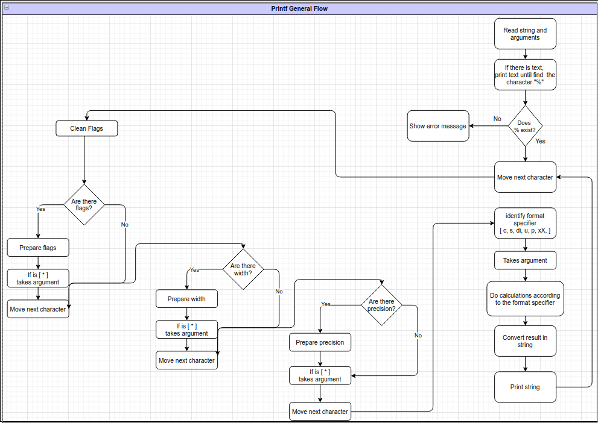
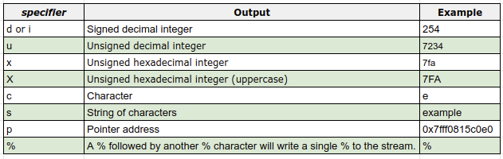
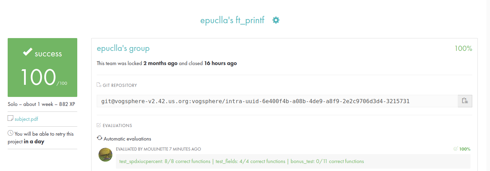

# ft_printf  :whale2: :turtle:

Library that contains ft_printf, a function that will mimic the real printf, It will manage the following conversions **[ cspdiuxX%]**

### ft_printf.c

```c
#include "../includes/ft_printf.h"

int	ft_printf(const char *format, ...)
{
	t_info		*info;
	int			length;

	info = (t_info *)ft_memalloc(sizeof(t_info));
	va_start(info->arguments, format);
	info->format = format;
	while (*info->format)
	{
		while (*info->format && *info->format != '%')
		{
			ft_putchar(*info->format);
			info->total_length++;
			info->format++;
		}
		if (*info->format && *info->format == '%')
			ft_eval_input(info);
	}
	va_end(info->arguments);
	length = info->total_length;
	free(info);
	return (length);
}
```

### ft_printf General Workflow :bell:



### See diagrams for each format specifier :octopus:

:paw_prints: [General workflow](https://viewer.diagrams.net/?page-id=1YTrTW2MsC1Di0wU-gv0&highlight=0000ff&edit=_blank&layers=1&nav=1&hide-pages=1#G1zPrMQ2q4wuR16TWdBtKlLVVquNKdpGmb) :paw_prints:

* :seedling: [Format Specifier - Char](https://viewer.diagrams.net/?page-id=sbkMw0dUxeduTBVlYtC2&highlight=0000ff&edit=_blank&layers=1&nav=1&hide-pages=1#G1zPrMQ2q4wuR16TWdBtKlLVVquNKdpGmb)
* :seedling: [Format Specifier - String](https://viewer.diagrams.net/?page-id=upzOOSU7zCkQETzXmLYp&highlight=0000ff&edit=_blank&layers=1&nav=1&page-id=upzOOSU7zCkQETzXmLYp#G1zPrMQ2q4wuR16TWdBtKlLVVquNKdpGmb)
* :seedling: [Format Specifier - Interger](https://viewer.diagrams.net/?page-id=2B_SWecsSpEZ6vEh3epM&highlight=0000ff&edit=_blank&layers=1&nav=1&hide-pages=1#G1zPrMQ2q4wuR16TWdBtKlLVVquNKdpGmb)
* :seedling: [Format Specifier - Pointer](https://viewer.diagrams.net/?page-id=cQUwrNA3bVdBqMu45jfG&highlight=0000ff&edit=_blank&layers=1&nav=1&hide-pages=1#G1zPrMQ2q4wuR16TWdBtKlLVVquNKdpGmb)
* :seedling: [Format Specifier - Unsigned](https://viewer.diagrams.net/?page-id=Jeof49Ll0B8E9NBXiXwg&highlight=0000ff&edit=_blank&layers=1&nav=1&hide-pages=1#G1zPrMQ2q4wuR16TWdBtKlLVVquNKdpGmb)


##  Format Specifiers


## Context

**[ flags ] [ width ] [ precision ]**

## Compilation
```bash
make all
gcc  ./tests/01_main_test_c.c libftprintf.a  -I ./include/
```
**Note.**: You can use **"make re"** to clean and build again

## Debug  Mode 

First change your Makefile, adding -g3
```c
@$(CC) -g3 $(CFLAGS) $(SRCS) -I$(INCLUDES)
```
Then, execute:
```bash
cd {$HOME}/42-silicon-valley-ft-printf
make all
gcc -g3 ./tests/01_main_test_c.c libftprintf.a
gcc -g3 ./tests/02_main_test_s.c libftprintf.a
gcc -g3 ./tests/03_main_test_di.c libftprintf.a
gcc -g3 ./tests/04_main_test_p.c libftprintf.a
gcc -g3 ./tests/05_main_test_x.c libftprintf.a
gcc -g3 ./tests/06_main_test_u.c libftprintf.a

lldb a.out
b main
run
gui

```
## :tv: Testers

- [ ESTERS-PRINTF ](https://github.com/Mazoise/42TESTERS-PRINTF ) (passed) from *Mazoise*
- [ pft ](https://github.com/gavinfielder/pft) (passed) from *gavinfielder*
- [ PRINTF_TESTER ](https://github.com/Kwevan/PRINTF_TESTER) from *Kwevan*
- [ printf_lover_v2 ](https://github.com/charMstr/printf_lover_v2) from *charMstr*

## :fireworks: Resources:
- https://docs.google.com/document/d/1znc7N5ua3WC1PhGcirRhtadHYSrPK3wxTApMdlJXYes/edit?pli=1#
- https://www.cplusplus.com/reference/cstdio/printf/
- https://www.cypress.com/file/54441/download
- http://www.cplusplus.com/reference/cstdio/printf/

## Norminette

Use and install this repository: 
[ Norminette ](https://github.com/42sp/norminette-client.git)

### Linux
```
echo 'alias norminette="~/.norminette/norminette.rb"' >> ~/.profile
source ~/.profile
```

### Run
```bash
norminette *.*
```

## Valgrind

```bash
make all

gcc ./tests/01_main_test_c.c libftprintf.a  -I ./include/
gcc ./tests/02_main_test_s.c libftprintf.a  -I ./include/
gcc ./tests/03_main_test_di.c libftprintf.a  -I ./include/
gcc ./tests/04_main_test_p.c libftprintf.a  -I ./include/
gcc ./tests/05_main_test_x.c libftprintf.a  -I ./include/
gcc ./tests/06_main_test_u.c libftprintf.a  -I ./include/
gcc ./tests/07_main_test_prc.c libftprintf.a -I ./include/

valgrind --tool=memcheck --leak-check=yes --show-reachable=yes --num-callers=20 --track-origins=yes --track-fds=yes ./a.out
```


## Graded by Moulinette



### ft_printf pdf  new curriculum
[Download from HERE](https://drive.google.com/file/d/1mnoosj61JIh1mJzK7XN3Q2VFhRK037T4/view?usp=sharing)
 
