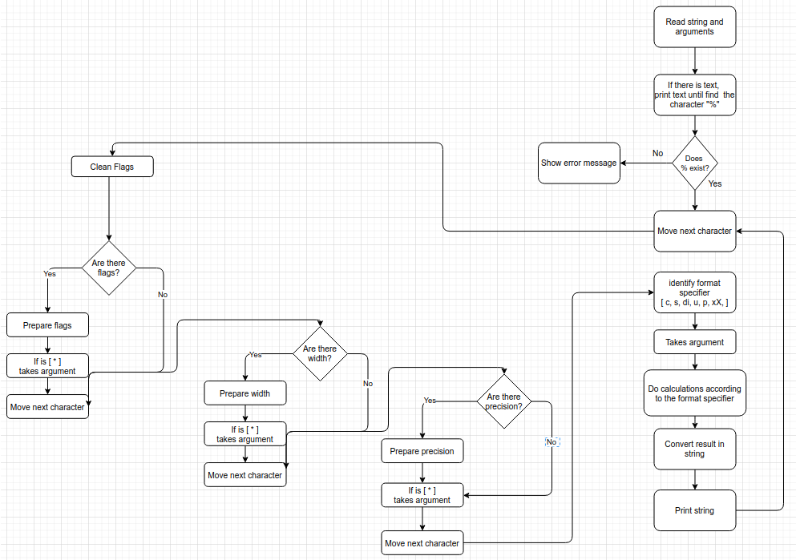

# :palm_tree:  ft_printf

### Info:
Write a library that contains ft_printf, a function
that will mimic the real printf, It will manage the following conversions: cspdiuxX%

### Printf Workflow

#### :bell: General WorkFlow



See workflow about each format specifier  [HERE](https://drive.google.com/file/d/1zPrMQ2q4wuR16TWdBtKlLVVquNKdpGmb/view?usp=sharing)

## Compilation
```bash
make all
gcc  ./tests/01_main_test_s.c libftprintf.a  -I ./include/
```
**Note.**: You can use **make re** to clean and build again

## Debug  Mode 

- First: Change your Makefile, adding -g3
```c
	@$(CC) -g3 $(CFLAGS) $(SRCS) -I$(INCLUDES)
```
Then execute:
```c
cd {$HOME}/42-silicon-valley-ft-printf
make all
gcc -g3 ./tests/01_main_test_s.c libftprintf.a
gcc -g3 ./tests/02_main_test_s.c libftprintf.a
gcc -g3 ./tests/03_main_test_di.c libftprintf.a
gcc -g3 ./tests/04_main_test_p.c libftprintf.a
gcc -g3 ./tests/05_main_test_x.c libftprintf.a
gcc -g3 ./tests/06_main_test_u.c libftprintf.a

lldb a.out
b main
run
gui

```
## Testers

- https://github.com/Mazoise/42TESTERS-PRINTF (passed)
- https://github.com/gavinfielder/pft	(passed)
- https://github.com/Kwevan/PRINTF_TESTER
- https://github.com/charMstr/printf_lover_v2

## :fireworks: Resources:
- https://docs.google.com/document/d/1znc7N5ua3WC1PhGcirRhtadHYSrPK3wxTApMdlJXYes/edit?pli=1#
- https://www.cplusplus.com/reference/cstdio/printf/
- https://www.cypress.com/file/54441/download

## Norminette

Use and install this repository: 
[ Norminette ](https://github.com/42sp/norminette-client.git)

**Run**
```bash
norminette *.*
```

## Valgrind

```bash
make all

gcc ./tests/01_main_test_c.c libftprintf.a  -I ./include/
gcc ./tests/02_main_test_s.c libftprintf.a  -I ./include/
gcc ./tests/03_main_test_di.c libftprintf.a  -I ./include/
gcc ./tests/04_main_test_p.c libftprintf.a  -I ./include/
gcc ./tests/05_main_test_x.c libftprintf.a  -I ./include/
gcc ./tests/06_main_test_u.c libftprintf.a  -I ./include/
gcc ./tests/07_main_test_prc.c libftprintf.a -I ./include/

valgrind --tool=memcheck --leak-check=yes --show-reachable=yes --num-callers=20 --track-origins=yes --track-fds=yes ./a.out

```